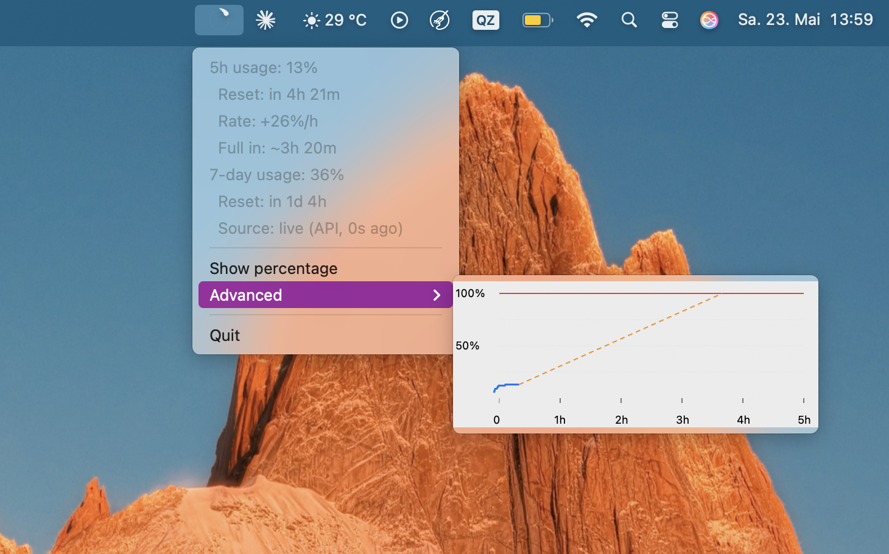

# Claude Token Ring

<picture>
  <source media="(prefers-color-scheme: dark)"  srcset="screenshots/ring-dark.gif">
  <source media="(prefers-color-scheme: light)" srcset="screenshots/ring-light.gif">
  
</picture>

macOS menu bar app that shows your [Claude.ai](https://claude.ai) token usage as a brushstroke ring icon — updated live from Claude Desktop, no separate API key needed.

The ring fills from empty (0 %) to full (100 %) as you consume your 5-hour quota. A usage chart in the menu lets you see how fast you're burning through it.

[▶ Live ring demo](https://marcz-02.github.io/claude-usage-bar/)



## Requirements

- macOS 12+
- [Claude Desktop](https://claude.ai/download) installed and logged in
- Python 3.9 from Xcode Command Line Tools (`xcode-select --install`)

## Install

```bash
git clone https://github.com/YOUR_USERNAME/ClaudeTokenRing.git
cd ClaudeTokenRing
./install.sh
```

The script installs Python dependencies and registers a LaunchAgent so the app starts automatically at login.

**First run:** macOS will show a Keychain prompt for **"Claude Safe Storage"** — click **Always Allow**. This is needed to read Claude Desktop's session cookie for direct usage lookups.

## What it shows

| Element | Meaning |
|---|---|
| Ring icon | Fills 0 → 100 % as you consume your 5-hour Claude quota |
| `%` label | Optional percentage next to the icon (`Show percentage` toggle) |
| Rate | Current consumption rate, e.g. `+18 %/h` |
| Full in | Projected time until 100 %, e.g. `~2h 15m` |
| Advanced ▸ | Chart of actual usage over the current 5-hour session |
| Export usage data… | Saves a CSV of all recorded samples to `~/Downloads` |

## Plan compatibility

Works with any Claude plan — the ring always reflects Claude's own utilisation percentage regardless of your quota size. The live API (tiers 1 and 2) is fully plan-agnostic. The fallback heuristic (tier 3) defaults to a 197 k-token limit, which may be inaccurate on plans with a different quota, but tier 3 is only active when Claude Desktop is not running.

## Live data access

The app continuously writes every sample to `~/.claude_token_ring_usage_log.jsonl` (one JSON object per line, updated every 30 s, up to ~6 months of history). You can read it directly at any time — no export step needed:

```python
import pandas as pd
import json
from pathlib import Path

lines = Path("~/.claude_token_ring_usage_log.jsonl").expanduser().read_text().splitlines()
df = pd.DataFrame([json.loads(l) for l in lines if l])
df["datetime"] = pd.to_datetime(df["ts"], unit="s", utc=True)
df = df.set_index("datetime").rename(columns={"util": "utilization_pct"})

df.plot(title="Claude token utilisation over time")
```

Each row: `ts` (Unix timestamp) · `util` (0–100 %).

## Export format

`Export usage data…` saves `~/Downloads/claude-usage-YYYYMMDD-HHMMSS.csv`:

```csv
timestamp,datetime_utc,utilization_pct
1716000000,2024-05-18T10:00:00Z,13.50
1716000030,2024-05-18T10:00:30Z,14.20
…
```

Up to 240 samples (one every 30 s) — roughly the last 2 hours of active usage.

## How data is read

Three tiers, freshest first — the **Source** line in the menu tells you which one is active:

1. **Claude Desktop's HTTP cache** — parses zstd-compressed JSON from disk; no network call needed
2. **Direct `/usage` API** — uses your Desktop session cookie; kicks in when the cache is stale (>60 s old)
3. **Fallback heuristic** — local token counter + session-anchor model; used only when both live paths fail (less accurate on cold start)

## Manage the app

```bash
# Restart
launchctl stop com.marcz.claude-token-ring && launchctl start com.marcz.claude-token-ring

# Logs
tail -f /tmp/claude-token-ring.log

# Uninstall
launchctl unload ~/Library/LaunchAgents/com.marcz.claude-token-ring.plist
rm ~/Library/LaunchAgents/com.marcz.claude-token-ring.plist
```

## Known limitations

- Requires Claude Desktop to be running for live data (tiers 1 and 2)
- On cold start without live API access the display may underestimate usage until Claude Desktop is opened
- macOS only

## License

[MIT](LICENSE)
